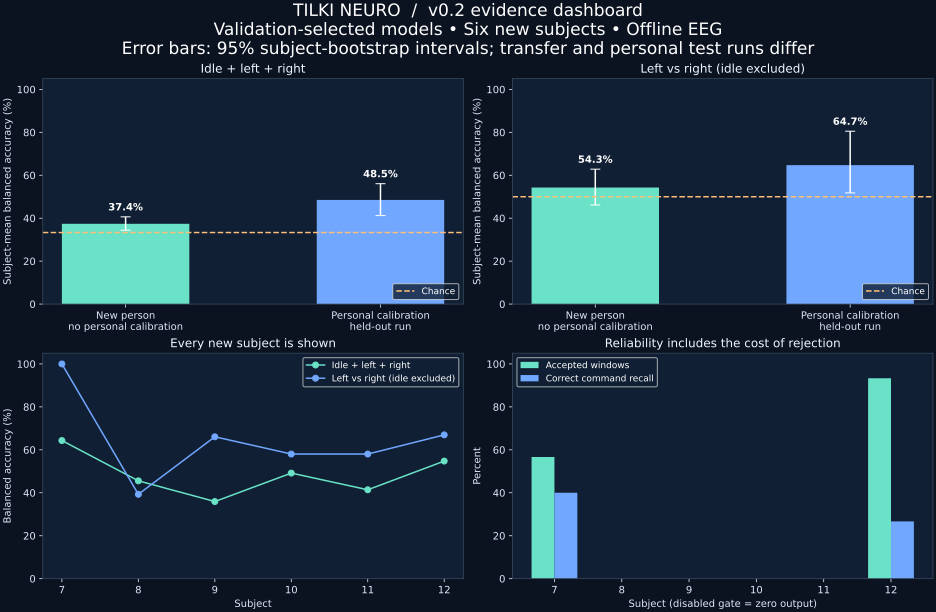

# TILKI NEURO

**A reproducible laboratory for reliable EEG command decoding.**

v0.2 expands the original prototype into a run-aware EEG research workbench:
spatial filtering, Riemannian geometry, validation-only model selection, explicit
abstention, subject uncertainty intervals, and an evidence console.

**Status:** experimental offline software. It is not an implant, fabricated
neurochip, medical device, or demonstrated communication aid. The algorithms are
established methods; this release does not claim a new scientific breakthrough.



## What actually changed

| v0.1 | v0.2 |
|---|---|
| Three EEG channels | 21 motor-area channels with common-average reference |
| One spectral classifier | Bandpower, CSP/LDA, filter-bank CSP, Riemannian tangent-space classifiers |
| One cross-subject split | Transfer to six new subjects and personal calibration with a held-out run |
| Threshold can reject almost everything | Command gate must meet error **and utility** criteria on validation |
| Synthetic demonstration | Real EEG evidence console plus the separate synthetic demonstration |
| Single headline accuracy | Every model, subject, confusion matrix, Brier score, and abstention cost |

## Actual held-out results

36 public EDF recordings from 12 volunteers produced 1,080 non-overlapping,
three-second windows. Development subjects: 1–6 (already used in v0.1).
New evaluation subjects: 7–12. All models were selected using validation data.

| Task | No personal calibration | Personal calibration | Chance |
|---|---:|---:|---:|
| Idle / left / right | 37.4% [34.4, 40.6] | 48.5% [41.2, 56.1] | 33.3% |
| Left vs right, **idle excluded** | 54.3% [46.2, 62.8] | 64.7% [51.8, 80.5] | 50% |

Values are **mean subject balanced accuracy**; brackets are 95% subject-bootstrap
percentile intervals from only six people. Transfer tests runs 4/8/12; personal
calibration trains on run 4, selects on run 8, and tests run 12. These columns are
not a matched causal estimate of the benefit of calibration. Same-day runs are
not independent long-term sessions. Binary accuracy does not establish reliable
idle detection, word decoding, or communication.

**Reliability is still unsolved.** The gate disabled all transfer commands and
four of six personal systems because validation could not meet both requirements:
idle false-activation fraction <=5% and correct active-command recall >=20%.
For subject 7, the enabled gate's test idle false-activation fraction was 6.7%,
exceeding the validation target; subject 12 had zero observed idle errors in only
15 idle test windows. A validation pass is not a test-time guarantee.

[Full study](examples/study-v0.2/study.json) ·
[Technical report](docs/STUDY_V0.2.md) ·
[Protocol frozen before evaluation](protocols/v0.2.json) ·
[Original v0.1 work](docs/V0.1.md)

## Install and explore

Python 3.10+:

```bash
git clone https://github.com/tilkitaha/TILKI-NEURO.git
cd TILKI-NEURO
python -m venv .venv
source .venv/bin/activate
# Windows: .venv\Scripts\activate
python -m pip install -e '.[research,test]'
python -m pytest -q
python -m tilki_neuro console examples/study-v0.2/study.json
```

The desktop console shows measured results, all candidate models, the protocol,
and gate status. It needs Tk and a graphical desktop. Its chart export was rendered
and inspected; desktop interaction was not verified in the headless authoring
environment. To view the results without Tk, open the dashboard above.

```bash
# Synthetic signals; actual inference, no headset connection:
python -m tilki_neuro demo
# Re-run the original toy benchmark:
python -m tilki_neuro benchmark
# Export charts from measured results:
python -m tilki_neuro figures examples/study-v0.2/study.json --output outputs/figures
```

## Reproduce the real EEG study

The old importer can download the required EDF files (its three-channel NPZ is
not used by the new study):

```bash
python -m tilki_neuro prepare-physionet --root data/edf \
  --subjects 1 2 3 4 5 6 7 8 9 10 11 12 --download
python -m tilki_neuro study --root data/edf \
  --protocol protocols/v0.2.json --output outputs/my-study
```

The study refuses to overwrite an existing `study.json`. Store each run separately.
Reports contain the protocol hash, EDF hashes, package versions, timing, individual
predictions and all results. No raw EEG is uploaded. Downloading requires network
access; all decoding runs locally.

The published prediction audit is compressed as `predictions.json.gz`. Read it with
`gzip.open(path, 'rt')` and `json.load`. Fresh study runs export plain JSON for ease
of inspection. `requirements-research-tested.txt` records the tested top-level
versions on Python 3.12; other Python versions resolve compatible dependencies
from `pyproject.toml`.

## Architecture

- `corpus.py`: channel order, reference, run/event provenance, isolated windows.
- `spatial.py`: four established sklearn-compatible pipelines.
- `study.py`: partition checks, validation-only selection, fail-closed command
  gate, subject-bootstrap intervals, artifact stress scenarios and prediction audit.
- `console.py` / `figures.py`: stored-evidence inspection and scientific plots.
- `communication.py`: phrase selection, idle rearming, confirmation and undo.
- `decoder.py` / `evaluate.py`: retained v0.1 baseline for reproducibility.

The spatial pipelines use **offline zero-phase filtering inside each epoch**.
They are not causal streaming decoders. Classifier scores are not calibrated
certainty. Noise, gain and flat-channel stress tests are controlled perturbations,
not a validated physiological drift model. No model learns from test labels.

## What would make this scientifically important?

The next contribution must improve reliability at matched useful throughput,
not just headline accuracy. The immediate gaps are independent-session validation,
stronger idle data, calibrated uncertainty, and a causal embedded implementation.
An independent neuroengineering lab should reproduce the result before any claim
of novelty or clinical relevance. See [the research plan](docs/STUDY_V0.2.md).

## Scientific foundations

- [PhysioNet EEGMMIDB](https://physionet.org/content/eegmmidb/1.0.0/): source data;
  retain dataset terms and cite its authors when using recordings.
- [MNE CSP example](https://mne.tools/stable/auto_examples/decoding/decoding_csp_eeg.html).
- [pyRiemann tangent-space methods](https://pyriemann.readthedocs.io/en/latest/generated/pyriemann.tangentspace.TangentSpace.html).
- [MOABB evaluation framework](https://moabb.neurotechx.com/docs/index.html):
  evaluation distinctions and reproducibility guidance. This is not a MOABB benchmark run.

[Model limitations](docs/MODEL_CARD.md) · [Validation](docs/VALIDATION.md)
